# flutter-flame-harness

**English** | [한국어](README.ko.md)

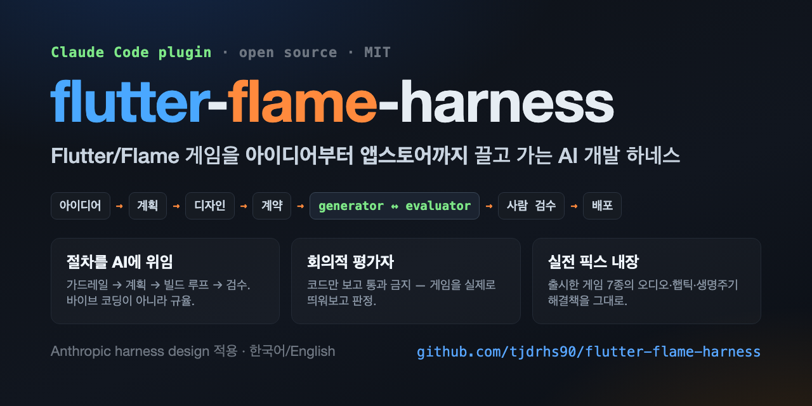

A Claude Code plugin that takes a Flutter/Flame game from raw idea all the way to the app stores. The harness orchestrates a structured pipeline of skills — research, planning, design, contract negotiation, and a generator–evaluator build loop — so every stage produces a verified, hand-off-ready artifact before the next one begins.

## Why

AI coding tools usually skip the boring parts — they code before pinning requirements, skip tests, and stop while it's half-done. This harness **delegates the process, not just the code**: guardrails → plan → a generator↔evaluator build loop with a *skeptical QA that runs the game before judging* → human review. And it isn't theory — the **fixes earned shipping real Flame games** (audio pooling, haptics, app-lifecycle, performance, store/build pitfalls) are baked in, so a generated game doesn't re-walk the same traps.

## Games

A mix of games I've shipped and games built with this harness — Flutter + Flame.

### Portrait

<table>
  <tr>
    <td align="center" valign="top">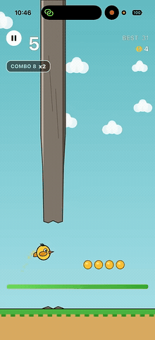<br><sub><b>Hover Hopper</b><br>Hold-to-rise stamina arcade</sub></td>
    <td align="center" valign="top">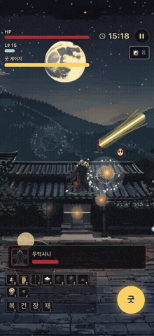<br><sub><b>Manshin</b><br>Korean shamanist action arcade</sub></td>
    <td align="center" valign="top">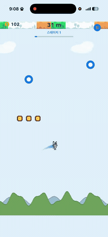<br><sub><b>Swing Line</b><br>One-tap physics arcade</sub></td>
    <td align="center" valign="top">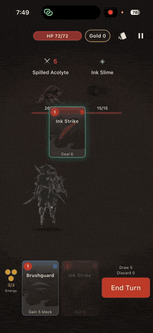<br><sub><b>Ink Spire: Sumi-e</b><br>Ink-painting deckbuilder</sub></td>
  </tr>
  <tr>
    <td align="center" valign="top">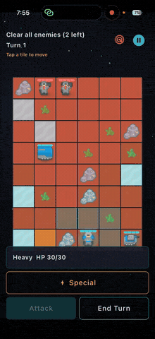<br><sub><b>Salvage Protocol</b><br>Turn-based tactics</sub></td>
    <td align="center" valign="top">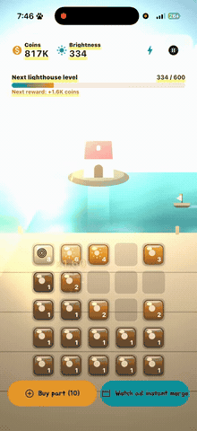<br><sub><b>Merge Lighthouse</b><br>Merge builder</sub></td>
    <td align="center" valign="top">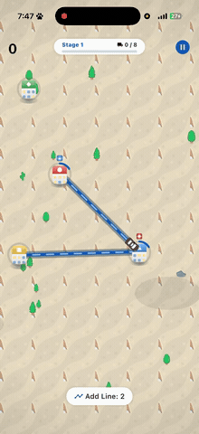<br><sub><b>Loop City</b><br>Loop-drawing city sim</sub></td>
  </tr>
</table>

### Landscape

<table>
  <tr>
    <td align="center" valign="top">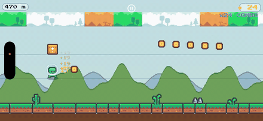<br><sub><b>Goni Run</b><br>Endless runner</sub></td>
    <td align="center" valign="top">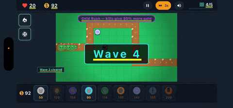<br><sub><b>Goni Defense</b><br>Tower defense</sub></td>
  </tr>
  <tr>
    <td align="center" valign="top">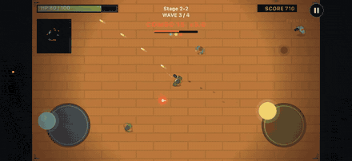<br><sub><b>TopShot</b><br>Top-down arcade shooter</sub></td>
    <td align="center" valign="top">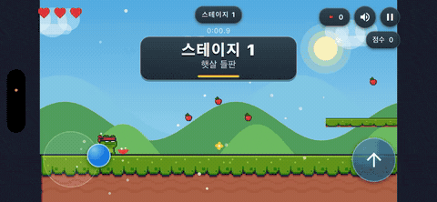<br><sub><b>Froggy Dash</b><br>Platformer</sub></td>
  </tr>
  <tr>
    <td align="center" valign="top">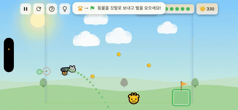<br><sub><b>Tumble Zoo</b><br>Physics puzzle</sub></td>
  </tr>
</table>

## Phases

**Phase A (complete): research → plan → design → contract → generator ↔ evaluator → playable game**

The generator and evaluator negotiate completion criteria before any code is written, then build the Flutter/Flame project in three sub-phases (scaffold → API wiring → UI polish), with the evaluator gating each hand-off.

See [`docs/SMOKE-TEST.md`](docs/SMOKE-TEST.md) for the full manual smoke-test procedure.

**Phase B (complete): admob, build, screenshot, submit, retro**

Automates AdMob integration, release builds (Android + iOS), App Store / Play Store screenshots, submission, and a post-launch retrospective.

See [`docs/SMOKE-TEST-phaseB.md`](docs/SMOKE-TEST-phaseB.md) for the full manual deploy dry-run procedure.

## Install

```bash
/plugin marketplace add <projects-dir>/flutter-flame-harness
/plugin install flutter-flame-harness
```

## Updating

The plugin is copied into a cache at install time, so editing the source doesn't take effect until
you re-sync. After pulling new commits (the version bumps each release):

```bash
/plugin marketplace update flutter-flame-harness   # re-sync the latest version into the cache
/reload-plugins                                     # apply it in the current session
```

Confirm the new version in `/plugin`. If a change doesn't appear, reinstall:

```bash
/plugin uninstall flutter-flame-harness@flutter-flame-harness
/plugin install flutter-flame-harness@flutter-flame-harness
```

(Last resort if the cache is stuck: `rm -rf ~/.claude/plugins/cache`, then restart Claude Code.)

## Usage

```
/flame-harness "<idea>"
/flame-harness
```

Run with a quoted idea to seed the pipeline directly. Run with no idea and the AI researches the
market, recommends 2-3 game concepts, and waits for you to pick one before proceeding. Add
`--auto-idea` to skip that prompt: no idea + `--auto-idea` → AI generates, scores, and auto-picks
a concept with no prompts (fully hands-off).

Flags:

| Flag | Default | Description |
|------|---------|-------------|
| `--strict` | off | Run the evaluator in strict 3-phase QA mode |
| `--rounds N` | 3 | Maximum generator–evaluator negotiation rounds |
| `--skip-research` | off | Skip the market-research phase |
| `--skip-admob` | off | Skip the AdMob phase |
| `--auto-idea` | off | Research scores its generated concepts and auto-picks the best — no pick prompt |
| `--auto-deploy` | off | Skip the post-QA human-review pause; PASS continues straight to deploy |
| `--resume` | — | Resume a paused run |

By default, after the build passes QA the harness **pauses for you to play and approve the game**
(`cd <slug> && flutter run`) before any deploy work; `/flame-harness --resume` continues to
admob→build→screenshot→submit. `--auto-deploy` skips this gate, and `--auto-idea --auto-deploy`
together run fully hands-off from idea to deploy.

## Phase A Skills

| Skill | Trigger command | Purpose |
|-------|----------------|---------|
| `flame-harness-research` | `/flame-harness-research` | Market research and genre analysis |
| `flame-harness-plan` | `/flame-harness-plan` | PRD (in your language), Flame component map, lib/ structure |
| `flame-harness-design` | `/flame-harness-design` | Visual style system and component specs |
| `flame-harness-contract` | `/flame-harness-contract` | Generator/evaluator negotiate completion criteria |
| `flame-harness-generator` | `/flame-harness-generator` | Build the Flutter/Flame project in 3 sub-phases |
| `flame-harness-evaluator` | `/flame-harness-evaluator` | QA gating — functional check or strict 3-phase |

## Phase B Skills

| Skill | Trigger command | Purpose |
|-------|----------------|---------|
| `flame-harness-admob` | `/flame-harness-admob` | Rewarded-ad strategy, guided AdMob unit creation, ATT/UMP code injection |
| `flame-harness-build` | `/flame-harness-build` | Credential bootstrap, fastlane config generation, IPA → TestFlight, AAB → internal track |
| `flame-harness-screenshot` | `/flame-harness-screenshot` | Store screenshots (game's locales) via integration_test, ASO metadata, fastlane upload |
| `flame-harness-submit` | `/flame-harness-submit` | Upload store text metadata + categories via fastlane, then pause for manual review submission |
| `flame-harness-retro` | `/flame-harness-retro` | Score the completed pipeline against 9 harness principles, write retrospective |

## File Protocol

See [`docs/harness-protocol.md`](docs/harness-protocol.md) for the full inter-skill file handoff protocol.

## Security

Credentials and secrets never enter this repository. The `.gitignore` permanently excludes `credentials/`, `secrets/`, `*.jks`, `*.p8`, `play-store-key.json`, and `sheets-key.json`. Never commit signing keys, API credentials, or service-account files — pass them via environment variables or a secrets manager at runtime.
